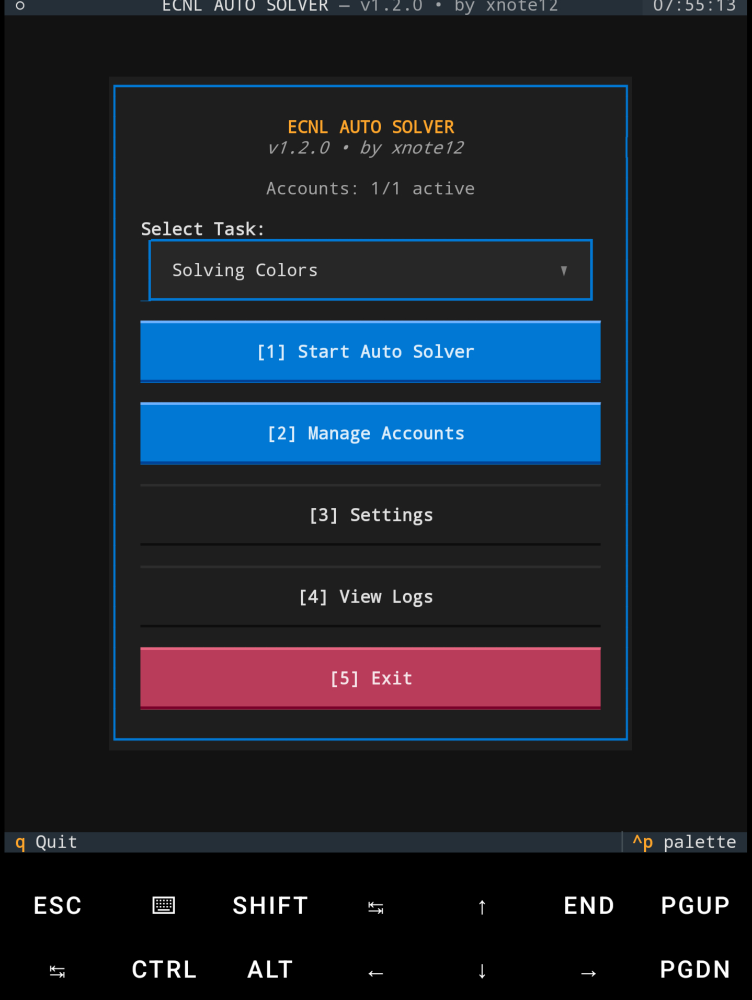
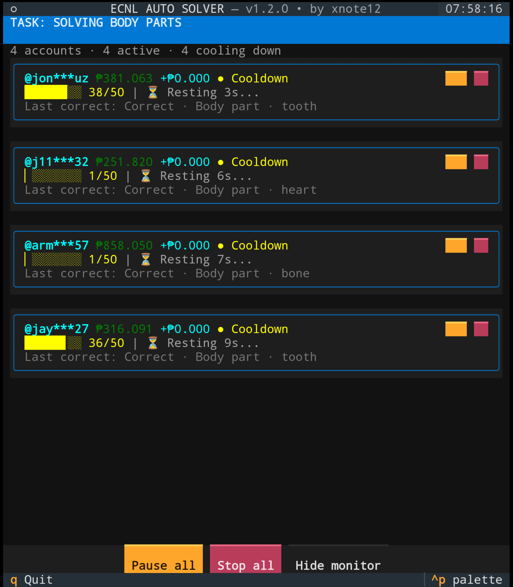

# ECNL Auto Solver

**Created by xnote12**

ECNL Auto Solver automates supported challenges on
[ECNL Media Market](https://ecnlmediamarket.com/) through an interactive terminal
interface or CLI. Built for **Android Termux on ARM64 / aarch64**.

## Features

- Solve Colors, Numbers, Math, and Body Parts tasks.
- Run multiple enabled accounts concurrently.
- Monitor wallets, earnings, and task progress.
- Pause or stop individual accounts or all accounts.
- Set cooldowns and per-account wallet targets.

## Sneak peek

| Main menu | Live account monitor |
| --- | --- |
|  |  |

## Install

```sh
pkg install curl tar coreutils util-linux
curl -fsSL https://github.com/samperez10/ecnl-bot/releases/latest/download/install.sh -o install-ecnl.sh
bash install-ecnl.sh
```

The app installs in `~/ecnl/` with a fresh, empty account configuration.

## Use

```sh
ecnl
```

Add and enable your accounts in **Manage Accounts**, activate your license in
**Settings**, then select a task and choose **Start Auto Solver**.

For CLI usage:

```sh
ecnl setup
ecnl status
ecnl run
ecnl run --task math
ecnl --help
```
